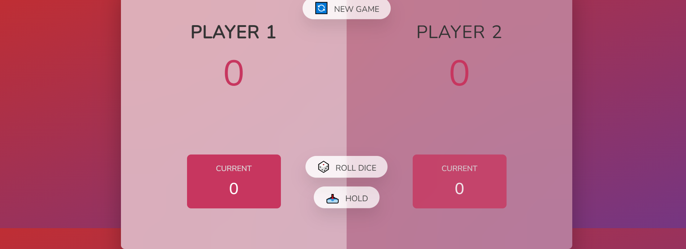

# Pig Game

A fun and simple 2-player dice game built with HTML, CSS, and JavaScript.

🔗 [Live Demo on Netlify](https://pig-game2025.netlify.app/)

## Game Description

The Pig Game is a turn-based dice game for two players. The goal is to be the first player to reach **50 points**. On each turn, a player can:

- Roll the dice as many times as they like.
- Each roll adds the dice number to their **current score**.
- But if they roll a **1**, they lose their current score and it becomes the next player's turn.
- At any time, the player can **"Hold"** to save their current score to their total score and pass the turn to the other player.

The first player to reach **50 points** wins the game! 

## How to Play

1. Click **"Roll Dice"** to roll the dice.
2. If the dice roll is **not 1**, the number adds to your **current score**.
3. If the dice roll is **1**, your turn ends and your current score is reset to 0.
4. Click **"Hold"** to add the current score to your **total score** and pass the turn.
5. First to **50 points** wins!

## Technologies Used

- HTML
- CSS
- JavaScript (Vanilla)

## Screenshot

## Contact

- GitHub: [@saharzakersoltani](https://github.com/saharzakersoltani)
- Email: sahar.zs2002@gmail.com
- LinkedIn: [Sahar Zaker Soltani](https://www.linkedin.com/in/sahar-zaker-soltani)

---

Enjoy the game and feel free to fork or contribute!

